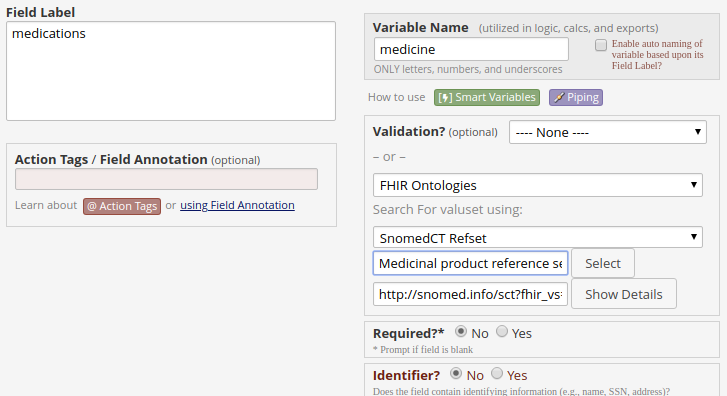
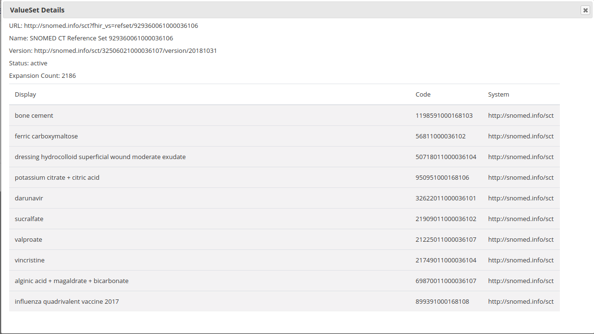

# FHIR Ontology External Module

As part of release 8.8.1 of REDCap an extension point was added to allow external modules to become an 
*'Ontology Provider'*. These act like the existing BioPortal ontology mechanism, but allow alternative sources.
The main function of an ontology provider is to take a search term and return some match of code + display.
You can see more information on implementing an Ontology Provider at the [Simple Ontology Provider](https://github.com/aehrc/redcap_simple_ontology_provider) external module home.

This module allows a FHIR based terminology server to be an alternative ontology provider.

This is done using the ValueSet/$expand operation

In version 0.3 of this module the online designer part of this module was changed to no longer talk directly from the
web browser to the fhir server, instead a web service is included in the module to allow for the requests to be made via
the redcap server. This change was needed to protect the authentication settings, it also allows the module to work from
behind a proxy server.


## Using the module
The module code needs to be placed in a directory `modules/fhir-ontology-provider_v0.3`

The module should then show up as an external module.

The following site wide setings are available:
  * `FHIR API URL` -this is the url for the fhir server. Two possible fhir end points are listed, but people may want to run their own server to have better control of the available ValueSets. 
     The two suggested fhir end points are:
     * `https://r4.ontoserver.csiro.au/fhir` which an Australian server with the Australian edition of SNOMED CT as its default. The server also contains LOINC and other code systems.
     * `https://snowstorm-fhir.snomedtools.org/fhir` is a test server hosted by snomed, it does not include LOINC or non-snomed code systems and valuesets. This means when selecting a valueset to use only the `SnomedCT Refset` and `SnomedCT isa implicit valueset` selection options will find a valueset.
  * `Add value tooltip` - The codes returned by lookup are returned in the format `code|display|system` this means the value displayed when an entry is selected is normally longer then the 12 or so characters normally used to display the code. This option will add a `title` attribute to the value display to show the value as a tooltip when the mouse is used to hover over the value. This will only show up in the data entry and survey forms, not testing in the online designed.
  * `Return 'No Results Found'` - This check box is used to indicate that a special value should be returned if no values are returned by a search. The purpose of this is to allow the option to be selected and then have an additional field get activated via branching logic to receive additional data.
     * `No Results Label` - The display value for the special value returned if the `return no results found` option is enabled. The Label cannot contain html markup.
     * `No Results Code` - The value for the special value returned if the `return no results found` option is enabled. The code cannot contain html markup, a single or double quote.
  * `Authentication Type` - The authentication to use when communicating with the FHIR server. This can be either `none`
     or `OAuth2 Client Credentials`. The client credentials flow uses a client id and secret to obtain an access token.
     * `OAuth2 token endpoint`  - The token endpoint used to obtain the access token. This is required for `Oauth2 Client Credentials` authentication type.
     * `Client Id` - The client id to use to fetch an access token. This is required for `Oauth2 Client Credentials` authentication type.
     * `Client Secret` - The client secret to use to fetch an access token. This is required for `Oauth2 Client Credentials` authentication type.

### Online designer

Once enabled the online designer will have a new ontology source availble. If selected the following UI elements will be made available:

-Search For valuset using: (dropdown with the options)
 - ValueSet Name - searching using the name of the valueset
 - By CodeSystem - searching using the name of the codesystem
 - SNOMED CT Refset - search for a SNOMED CT Refset
 - SNOMED CT isa implicit valueset - search for a SNOMED CT concept and use the valueset composed of it and its children
 - LOINC implicit answer set - search for a LOINC implicit answer set
    
-text input with autocomplete based on the search mode

-select button - Select the valueset found using the search, making it the selected valuset

-text input which is filled out by the search button, contains the uri for the selected valueset

-Show details button - Retrieve the first 10 entries of the selected valueset, and display along with other information about the valueset in a dialog.





### Label Cache Issue

When an ontology is chosen for use in a text field, this is stored using the syntax `<SERVICE>:<CATEGORY>` inside the `element_enum` column of the fields metadata. 
For this module we use `FHIR:<ValueSetUrl>`. The search function then calls `<fhirServerUrl>/ValueSet/$expand?url=<ValueSetUrl>&filter=<searchTerm>&count=<resultLimit>`

When a user fills in the field, REDCap will store only the code for the selected item with the form. It will also add a record to the `redcap_web_service_cache` table 
which links the label for the selected item back to its code. This causes an outstanding issue with the module. The `redcap_web_service_cache` table is defined to
have up to 50 characters for the category, but the ValueSet url this module uses as the category may be much larger. For example the Medicinal product reference set 
from the Australian version of SNOMED CT would have a url of `http://snomed.info/sct/32506021000036107?fhir_vs=refset/929360061000036106` which is 74 characters long.

This results in the category field being truncated when stored in the cache table, and then retrival from the cache will fail. 

The fix for this problem is to extend the size of the cache table.
```
alter table redcap_web_service_cache change category varchar(100); 
```

If the module is already in use and you need to fix the issue then first determine what value sets are in use in your system:
```
select substr(element_enum, 6) as full, substr(element_enum, 6, 50) as truncated from redcap_metadata where element_enum like 'FHIR%' and length(element_enum) > 55;
```

Any returned rows indicates possible issues

eg
```
+----------------------------------------------------------+----------------------------------------------------+
| full                                                     | truncated                                          |
+----------------------------------------------------------+----------------------------------------------------+
| http://snomed.info/sct?fhir_vs=refset/929360061000036106 | http://snomed.info/sct?fhir_vs=refset/929360061000 |
+----------------------------------------------------------+----------------------------------------------------+
```

To update any cached values use the sql:

```
update redcap_web_service_cache set category=<full> where category=<truncated>;

```

Where `<full>` and `<truncated>` are the values returned from the earlier query.

```
update redcap_web_service_cache set category='http://snomed.info/sct?fhir_vs=refset/929360061000036106' where category='http://snomed.info/sct?fhir_vs=refset/929360061000'
```


## FHIR based Terminolgy Service

The FHIR terminology specification is based on two key concepts, originally defined in HL7 v3 Core Principles : 

- *code system* - defines a set of codes with meanings (also known as enumeration, terminology, classification, and/or ontology) 

- *value set* - selects a set of codes from those defined by one or more code systems 
Code systems define which codes (symbols and/or expressions) exist, and how they are understood. Value Sets select a set of codes from one or more code systems to specify which codes can be used in a particular context. 


Implicit value sets are those whose specification can be predicted based on the grammar of the underlying code system, and the known structure of the URL that identifies them. Both SNOMED CT and LOINC define implicit value sets. LOINC defines implicit value set for answer lists, SNOMED CT has two common sets of implicit value sets defined: By Subsumption, and By Reference Set.

A SNOMED CT implicit value set URL has two parts: 
- the base URL is either "http://snomed.info/sct", or the URI for the edition version, in the format specified by the IHTSDO the SNOMED CT URI Specification 
- a query portion that specifies the scope of the content 

"http://snomed.info/sct" should be understood to mean an unspecified edition/version. This defines an incomplete value set whose actual membership will depend on the particular edition used when it is expanded. If no version or edition is specified, the terminology service SHALL use the latest version available for its default edition (or the international edition, if no other edition is the default). 

The default terminology service for this module, `https://ontoserver.csiro.au/stu3-latest` is an Australian server and has the Australian edition of SNOMEDCT as its default.

To define an edition and version the url is `http://snomed.info/sct/<edition>/version/<version>`. To get the latest version of an edition then `http://snomed.info/sct/<edition>` is used.

A list of known editions can be found at https://confluence.ihtsdotools.org/display/DOC/List+of+SNOMED+CT+Edition+URIs

For the second part of the URL (the query part), the 4 possible values are: 
- *?fhir_vs* - all Concept IDs in the edition/version. If the base URI is http://snomed.info/sct, this means all possible SNOMED CT concepts 
- *?fhir_vs=isa/[sctid]* - all concept IDs that are subsumed by the specified Concept. 
- *?fhir_vs=refset* - all concept ids that correspond to real references sets defined in the specified SNOMED CT edition 
- *?fhir_vs=refset/[sctid]* - all concept IDs in the specified reference set


To explore SNOMED CT check out Shrimp http://ontoserver.csiro.au/shrimp
