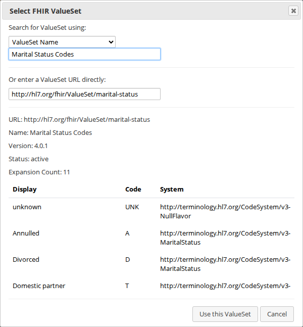

# FHIR Ontology External Module

The sections below give the full story behind each version's changes - why, not just what. For a terser,
automatically generated commit-by-commit record, see [CHANGELOG.md](./CHANGELOG.md).

## Requirements

- PHP 8.0.0 or later
- REDCap 8.8.1 or later, on External Module framework version 16 or later

As part of release 8.8.1 of REDCap an extension point was added to allow external modules to become an 
*'Ontology Provider'*. These act like the existing BioPortal ontology mechanism, but allow alternative sources.
The main function of an ontology provider is to take a search term and return some match of code + display.
You can see more information on implementing an Ontology Provider at the [Simple Ontology Provider](https://github.com/aehrc/redcap_simple_ontology_provider) external module home.

This module allows a FHIR based terminology server to be an alternative ontology provider.

This is done using the ValueSet/$expand operation

In version 0.3 of this module the online designer part of this module was changed to no longer talk directly from the
web browser to the fhir server, instead a web service is included in the module to allow for the requests to be made via
the redcap server. This change was needed to protect the authentication settings, it also allows the module to work from
behind a proxy server.

In version 0.4 of this module, limited support for @HIDECHOICE was added.

### @HIDECHOICE never actually worked from a real data-entry request, and @FHIR-ONTOLOGY-HIDECHOICE added

- ***Fixed: @HIDECHOICE was silently ignored on every real autocomplete search***
`getHideChoice()`'s in-memory fast path read the field's annotation from `$Proj->metadata[$field]['field_annotation']`,
but REDCap's real in-memory project metadata stores it under the raw DB column name `misc` - `field_annotation` is
a key name that only exists in `getDataDictionary()`'s own returned array. Because the fast path's *presence* check
(`isset($Proj->metadata[$field])`) still succeeded, it never fell through to the (correct) `getDataDictionary()`
branch - it just silently returned no annotation, and therefore no hidden codes, for every real request. This had
been broken since @HIDECHOICE was introduced in 0.4; it only ever appeared to work in this module's own test suite,
whose fakes made the same `field_annotation` mistake.
- ***Added: `@FHIR-ONTOLOGY-HIDECHOICE`, a second tag name for the same purpose***
`@HIDECHOICE` is also REDCap's own built-in action tag (for a different purpose, on real choice fields), and a
module-provided action tag whose name collides with a built-in one is silently dropped from REDCap's own
"@ Action Tags" popup rather than shown - so this module's repurposing of `@HIDECHOICE` could never be documented
there. `@FHIR-ONTOLOGY-HIDECHOICE` is a new, non-colliding tag name recognized for exactly the same purpose,
registered in that popup; both names are supported and can be freely mixed on the same field. See
[@HIDECHOICE support](#hidechoice-support) below.

### Online Designer ontology picker redesigned as a single popup dialog

- ***BREAKING: the inline search/select/manual-entry widget is gone***
The Online Designer's field editor previously showed the search-type dropdown, an autocomplete search box, a
"Select" link, a separate manual ValueSet URL field, and a "Show Details" link inline, all at once. It is replaced
by a compact "Selected ValueSet: `<name or URL>`" summary and a single "Change..." button.
- ***Search, manual entry, and details are now one dialog***
Clicking "Change..." opens one popup containing the search-type selection, the name/CodeSystem/SNOMED CT/LOINC
autocomplete search, a manual ValueSet URL field, and the ValueSet's details/expansion table together - previously
the details view was a separate popup only reachable after first committing a selection.
- ***Selecting a ValueSet no longer commits immediately***
Picking a search result or typing a URL now only loads that ValueSet's details for review inside the dialog. The
field's saved ontology selection only changes when "Use this ValueSet" is clicked; "Cancel" (or closing the
dialog) discards whatever was being reviewed and leaves the previously saved selection untouched.
- ***No stored data format change***
The value saved against a field (`FHIR:<valueset-url>`) is exactly the same as before this change; only the Online
Designer's own UI for choosing it is different. Fields configured under the old widget need no migration.

### @FHIR-ONTOLOGY-OPTIONS action tag

- ***Field-level control over search-all, stored value format, and priority codes***
A new `@FHIR-ONTOLOGY-OPTIONS` action tag lets a project designer opt an individual field into `return-all` (browse a
small answer-list ValueSet without needing to guess its exact wording), `code-template` (override the stored
value's format), and `priority-codes` (push specific codes to the top of results) - see
[@FHIR-ONTOLOGY-OPTIONS support](#fhir-ontology-options-support) below for the full syntax and worked examples.
- ***The Online Designer's "Select FHIR ValueSet" dialog now suggests it automatically***
When a previewed ValueSet is small (20 entries or fewer) and/or confirmed to use only one code system - either a
known single-system shape (a SNOMED CT implicit valueset, or a LOINC implicit answer list) or every entry actually
returned - the dialog shows a suggested `@FHIR-ONTOLOGY-OPTIONS` tag with a "Copy" button, ready to paste into the
field's own Action Tags / Field Annotation box.

### Online Designer ontology picker now uses REDCap's module.ajax()

- ***`FindValueSetService` page removed***
The Online Designer's ontology search and "Show Details" lookup used to call a standalone module page,
`FindValueSetService.php`, directly from hand-written `$.ajax()` calls. That page is gone; the same two lookups
(`find-valueset`, `get-valueset-info`) are now served through REDCap's own JavaScript Module Object
(`window.<module>.ajax(...)`, declared in `config.json`'s `auth-ajax-actions`), which handles authentication and
CSRF internally rather than the module managing a raw page URL and token by hand. No user-visible behavior change.

### Credential masking in the configuration page

- ***Credential fields now masked in the configuration page***
Both the Basic Auth password and the OAuth2 client secret now render masked in the module configuration page,
instead of being displayed in plain text.
- ***The stored credentials do NOT migrate***
Changing a setting's type does not migrate the value already stored for it. Both the Basic Auth password and the
OAuth2 client secret must be re-entered immediately after upgrading, or FHIR lookups will start failing. This
failure is silent: the lookup fails and the dropdown comes back empty, with no error shown to the user. This is why
both credentials must be re-entered immediately after upgrading.
- ***Masking is display only - it does NOT encrypt the value at rest***
This change only masks the value shown in the configuration page. It does not encrypt the value in storage. The
External Modules documentation states that values saved with a password setting are still stored as plain text.
The credential remains readable in the `redcap_external_module_settings` table and in database backups.

### Security and performance fixes

These changes address security and performance issues raised in review. There are no new features.

- ***Terminology lookup web service now requires authentication***
The `FindValueSetService` page was previously declared as a no-auth page, meaning it could be called without logging
in to REDCap. Because the FHIR server is typically on an internal network while REDCap is internet facing, this
allowed anonymous users to query the terminology server through REDCap and read its responses. The no-auth
declaration has been removed; the online designer is unaffected because it never used the no-auth route.
- ***Requests to the FHIR server now bound both connection time and total time***
A `FHIR request timeout (seconds)` setting (default 10) bounds how long REDCap waits both to *connect* to the
terminology server and to complete the entire request. REDCap core's own `http_get()`/`http_post()` helpers only
ever set curl's connect timeout, not its total-time timeout (confirmed by reading `Config/init_functions.php`), so
a server that accepts the connection and then stalls could still hold a web server process open indefinitely -
this module now makes its own curl calls (`curlGetWithTotalTimeout()`/`curlPostWithTotalTimeout()`), deliberately
kept close to core's own curl option set, with `CURLOPT_TIMEOUT` added on top. The `file_get_contents` fallback
used when curl is unavailable already had a true end-to-end limit via its stream context `timeout` option, and is
unaffected by this change. The circuit breaker below remains useful on top of this for the stampede case -
repeated slow failures from an unhealthy server - rather than for bounding any single call, which this timeout now
does directly.
- ***Outbound FHIR requests are now constrained to the configured server***
Every URL this module builds before sending a request is checked against the configured `FHIR API URL`: it must
address the same origin and sit at or below its path. A request that would fall outside that (for example, one
built from a malformed or hostile setting) is refused rather than sent. See `FhirRequestPolicy::isWithinBase()`
for exactly what this does and does not cover.
- ***Circuit breaker for terminology server failures***
After 3 consecutive *slow* failures - calls that consume most of the timeout before failing - the module stops
calling the FHIR server for 60 seconds and returns no results immediately, then lets a trial request through to
check for recovery. A fast failure, such as a quick 4xx response, neither counts towards this nor resets the count.
The count and the window are held in module settings without locking, so under concurrent load the breaker may admit more than one trial request per window and
may open after slightly more than 3 failures. It is a stampede guard, not a precise counter. If ontology autocomplete
appears dead for up to a minute after a terminology server restart, this is why. It protects REDCap as a whole from
being taken down by terminology server downtime.
- ***Fixed a data dictionary reload on every keystroke***
`@HIDECHOICE` support was reloading the project data dictionary on every autocomplete keystroke, for every project,
whether or not the field used `@HIDECHOICE`. The lookup now uses the already loaded project metadata where available.
- ***Fixed OAuth2 token expiry calculation***
Token lifetimes were treated as milliseconds rather than seconds, so an expired token could be reused for weeks,
causing lookups to fail silently. This did not affect Basic Auth or unauthenticated servers, but would have affected
any site using OAuth2 client credentials.
- ***Fixed cross site scripting in the ValueSet details dialog***
The Show Details dialog inserted values from the FHIR server into the page as HTML. Values are now inserted as text.
- ***More robust error handling***
Responses that are not valid JSON, expansions missing `code`, `system` or `display`, and unknown web service actions
are now handled explicitly instead of producing PHP warnings.

### Version 0.5 changes 

- ***Change storage format***
In version 0.5 of this module the way the selected code is stored has been changed. In earlier version the code used the
format `${code}|${display}|${system}` as returned by the fhir server. If the display was large, this could result in
a code which was more than 100 characters which would make the display lookup fail. Instead just '${code}|${system}'
will be stored.
- ***Basic Authentication support***
The group behind LOINC have made available a FHIR terminology server. More information can be found at https://loinc.org/fhir/
. This server uses basic authentication and can be used if LOINC answer lists are required but not SNOMEDCT or other
code systems.
- ***Ability to manually edit the valueset url in designer***
In older versions of the module, the valueset url to use had to be found and selected using one of the available search
options. This input field may now be edited to allow the manual entry of the valueset url. This makes it easier to
standardise on specific valuesets and allows the entry of an implicit snomed ECL valueset.
- ***Search by CodeSystem changed from name to title search***
A CodeSystem has a name and title, with the title designated as the human friendly name. This change should show more
appropriate names when searching my CodeSystem.
- ***Added setting 'SNOMEDCT Support'***
This checkbox indicates the FHIR server support implicit SNOMED CT valuesets. If not checked the search by 
'SNOMED CT Refset' and 'SNOMED CT isa implicit valueset' will not be made available. 
- ***Added setting 'LOINC Support'***
This dropdown controls the use of search by 'LOINC implicit answer set' and is needed to deal with different implementations
of LOINC in different servers. 


## Using the module
The module code needs to be placed in a directory named `modules/fhir-ontology-provider_v<version>`, matching
the version number of the release you downloaded (e.g. `modules/fhir-ontology-provider_v1.0.0`).

The module should then show up as an external module.

The following site wide settings are available:
  * `FHIR API URL` - this is the url for the fhir server. Two possible fhir end points are listed, but people may want to run their own server to have better control of the available ValueSets. 
     The two suggested fhir end points are:
     * `https://tx.ontoserver.csiro.au/fhir` an Australian server with the Australian edition of SNOMED CT as its default. The server also contains LOINC and other code systems.
     * `https://snowstorm-fhir.snomedtools.org/fhir` is a test server hosted by snomed, it does not include LOINC or non-snomed code systems and valuesets. This means when selecting a valueset to use only the `SnomedCT Refset` and `SnomedCT isa implicit valueset` selection options will find a valueset.
     * `https://fhir.loinc.org` is a test server hosted by LOINC (see https://loinc.org/fhir/). This server uses basic authentication and only contains LOINC, not SNOMED CT or other valuesets.
  * `FHIR request timeout (seconds)` - the maximum time to wait both to *connect* to the FHIR server and to complete the entire request before giving up. Defaults to 10 seconds if left blank. Protects against both an unreachable/refusing host and one that accepts the connection and then stalls (see "Security and performance fixes" below). Increase it if the terminology server is slow; decrease it to fail faster.
  * `SNOMEDCT Support` - when this checkbox is checked the search by 'SNOMED CT Refset' and 'SNOMED CT isa implicit valueset' will be made available.
  * `LOINC Support` - this dropdown controls the use of search by 'LOINC implicit answer set'. It options are
    *  `LOINC not available` - The search by 'LOINC implicit answer set' will not be available.
    *  `Ontoserver LL parent concept` - Ontoserver stores LOINC with an additional concept 'LL' which is the parent to all codes beginning with 'LL', this allows direct searching for answer lists.
    *  `Filter LLxxxxx concepts from expand` - The LOINC demonstration server doesn't have the 'LL' parent like ontoserver, in this case a search of all of loinc is used and only codes starting with LL are returned. Unfortunately this mechanism does not work on ontoserver, as its standard loinc search does not return codes starting with LL
  * `Add value tooltip` - The codes returned by lookup are returned in the format `'code|system'` this means the value displayed when an entry is selected is normally longer then the 12 or so characters normally used to display the code. This option will add a `title` attribute to the value display to show the value as a tooltip when the mouse is used to hover over the value. This will only show up in the data entry and survey forms, not testing in the online designed.
  * `Return 'No Results Found'` - This check box is used to indicate that a special value should be returned if no values are returned by a search. The purpose of this is to allow the option to be selected and then have an additional field get activated via branching logic to receive additional data.
     * `No Results Label` - The display value for the special value returned if the `'return no results found'` option is enabled. The Label cannot contain html markup.
     * `No Results Code` - The value for the special value returned if the `'return no results found'` option is enabled. The code cannot contain html markup, a single or double quote.
  * `Authentication Type` - The authentication to use when communicating with the FHIR server. This can be either `'none'`,
     `'OAuth2 Client Credentials'` or `'Basic Auth'`. The client credentials flow uses a client id and secret to obtain an access token.
     * `OAuth2 token endpoint`  - The token endpoint used to obtain the access token. This is required for `'Oauth2 Client Credentials'` authentication type.
     * `Client Id` - The client id to use to fetch an access token. This is required for `'Oauth2 Client Credentials'` authentication type.
     * `Client Secret` - The client secret to use to fetch an access token. This is required for `'Oauth2 Client Credentials'` authentication type.
     * `Basic Auth User Id` - The user id to use when `'Basic Auth'` is selected.
     * `Basic Auth User Password` - The password to use when `'Basic Auth'` is selected.

### Online designer

Once enabled the online designer will have a new ontology source available. Selecting `FHIR` as the field's ontology
source replaces the field's search-type/autocomplete/details controls with a compact "Selected ValueSet:" summary and
a single "Change..." button (see [Online Designer ontology picker redesigned as a single popup dialog](#online-designer-ontology-picker-redesigned-as-a-single-popup-dialog)
above). Clicking "Change..." opens one dialog containing:

- **Search for ValueSet using:** a dropdown choosing how the search box below it matches, with the options:
  - ValueSet Name - searching using the name of the valueset
  - By CodeSystem - searching using the title of the codesystem
  - SNOMED CT Refset - search for a SNOMED CT Refset
  - SNOMED CT isa implicit valueset - search for a SNOMED CT concept and use the valueset composed of it and its children
  - LOINC implicit answer set - search for a LOINC implicit answer set
- an autocomplete search box driven by the search-type above, for finding a ValueSet without already knowing its URL
- **Or enter a ValueSet URL directly:** a text input holding the URI of the ValueSet under review - filled in
  automatically by picking an autocomplete result, or editable directly if the URL is already known
- a details panel showing the reviewed ValueSet's URL/name/version/status/expansion count, a suggested
  `@FHIR-ONTOLOGY-OPTIONS` tag when the ValueSet looks like a good fit for `return-all` (see
  [@FHIR-ONTOLOGY-OPTIONS support](#fhir-ontology-options-support) below), and a table of its first entries
  (Display/Code/System)
- **"Use this ValueSet"**/**"Cancel"** buttons - picking a search result or typing a URL only loads that ValueSet's
  details for review; the field's saved selection only changes once "Use this ValueSet" is clicked, and "Cancel" (or
  closing the dialog) discards the review and leaves the previously saved selection untouched




### @HIDECHOICE support
As part of the 0.4 release extra functionality has been added to this module for it to consider the `@HIDECHOICE`
action tag. This action tag is available for choice fields to indicate a choice should not be shown. 
The @HIDECHOICE action tag is specified at a field level, the values will only be hidden for the field the
action tag is specified for. The set of values to hide is defined using a comma separated list of codes for the
values which should be hidden. The value is matched against the FHIR code only, it does not consider the system
of the value. If a valueset contains multiple values with the same code but different systems, then this cannot be
differentiated. The module considers all @HIDECHOICE entries found in the annotations property of the field.
```text
@HIDECHOICE='code1,code2'
```

`@HIDECHOICE` is also REDCap's own built-in action tag, used for a different purpose on real choice fields
(checkbox/radio/dropdown/yes-no/true-false). Because this module's FHIR autocomplete fields are plain text fields,
core's own `@HIDECHOICE` behavior never applies to them, so there's no functional conflict - but it does mean this
module's use of the same tag name can never appear in REDCap's own "@ Action Tags" popup (a module tag colliding
with a built-in tag of the same name is silently dropped from that list, not shown). `@FHIR-ONTOLOGY-HIDECHOICE` is
a second, equivalent tag name - registered in that popup - that this module recognizes for exactly the same
purpose. Both are supported and can be freely mixed; a field can use either name, or both at once (the hidden-code
lists are merged):
```text
@FHIR-ONTOLOGY-HIDECHOICE='code1,code2'
```

**Piping is not supported, and not currently possible, in `@HIDECHOICE`'s or `@FHIR-ONTOLOGY-HIDECHOICE`'s
argument** (e.g. `@HIDECHOICE='[other_field]'` to hide a code chosen by another field's answer) - see the note at
the end of [@FHIR-ONTOLOGY-OPTIONS support](#fhir-ontology-options-support) below, which explains why and applies
equally here.


### @FHIR-ONTOLOGY-OPTIONS support
`@FHIR-ONTOLOGY-OPTIONS` is a field-level action tag (same convention as `@HIDECHOICE` above) that controls how the
Online Designer's data-entry autocomplete search behaves for that specific field. It takes a **semicolon**-separated
list of options - not comma-separated like `@HIDECHOICE` - because one of the options (`priority-codes`) needs its
own comma-separated list of codes, and a plain comma-separated option list would make that ambiguous to split.
Options are combined in one tag:
```text
@FHIR-ONTOLOGY-OPTIONS='return-all;code-template=${CODE};priority-codes=code1,code2'
```
Unrecognized options (or the whole tag being malformed) are silently ignored, rather than causing an error - a
mistyped option just means that option doesn't apply, not a broken field.

  * ***return-all*** - Without this option, every autocomplete search sends the typed text to the FHIR server as a
    filter, so nothing appears unless the typed text happens to textually match the server's `display` wording for
    an entry. For a small, fully-enumerated answer-list ValueSet (a handful of values, e.g. a frequency-of-use
    scale), this makes it hard to actually browse the options. With `return-all` set, the field's search instead
    drops the server-side text filter and ranks entries locally - anything whose code or display matches the typed
    text sorts first, everything else follows. **This option is intended for small ValueSets only, and does not
    actually fetch every entry in the ValueSet: the server is still asked for at most the field's result limit
    (20 by default), just without a filter.** An entry beyond that limit in the server's own ordering is never
    fetched at all, so it can never appear locally-ranked as a match either, no matter how well its code or display
    matches the typed text - the omission is silent, with no indication to the user that anything is missing.
    Setting this on a ValueSet larger than the result limit therefore risks making some otherwise-valid entries
    permanently unreachable by search; setting it on a large ValueSet (SNOMED CT, etc.) is also simply slow and
    wasteful, since the full unfiltered request is repeated on every search keystroke.
  * ***code-template*** - Overrides the format of the value stored in REDCap for this field, the same way
    `advanced_fhir_ontology_provider`'s per-category `Code Template` setting does. Without this option, the stored
    value is `${CODE}|${SYSTEM}` (unchanged from previous versions of this module). The template replaces
    `${CODE}` and `${SYSTEM}` with the values returned from the FHIR terminology server; `${DISPLAY}` is not
    supported here (unlike `advanced_fhir_ontology_provider`, this module doesn't template the displayed label,
    only the stored value). Some FHIR ValueSets are composed of values from multiple code systems, making the code
    + system required for a unique coding - **if the ValueSet used on this field only contains values from a
    single code system, `code-template=${CODE}` can be used to store just the bare code.** Using a code-only
    template on a ValueSet that does span multiple code systems risks two different real answers colliding under
    the same stored value (whichever one is returned last in a given search silently overwrites the other in that
    search's results), and also means REDCap's own web-service label cache (keyed by the stored value) can show
    the wrong cached label for a later record that picked the other system's entry with the same code. This is the
    same trade-off `advanced_fhir_ontology_provider`'s admins already accept for its `Code Template` setting - only
    use `code-template=${CODE}` when you know the field's ValueSet doesn't have colliding codes across systems.
  * ***priority-codes*** - A comma-separated list of codes that should sort to the top of a field's search results
    whenever they appear among them, in the order listed (matching only the FHIR code, not the system - same as
    `@HIDECHOICE` above). A code listed in both `@HIDECHOICE` and `priority-codes` is excluded entirely; hiding a
    choice always takes priority over prioritizing it.

**Piping is not supported, and not currently possible, in any of `@FHIR-ONTOLOGY-OPTIONS`'s options** (e.g.
`priority-codes=[other_field]`) **or in `@HIDECHOICE`'s or `@FHIR-ONTOLOGY-HIDECHOICE`'s argument.** REDCap core's
own built-in `@HIDECHOICE` resolves piping in its argument via `Piping::replaceVariablesInLabel($text, $record,
$event_id, $instance, ...)`, which needs to know which record is currently being edited. This module's field-level
tags are all read from inside `DataEntry/web_service_auto_suggest.php` - the same real endpoint every search on the
field hits - and that endpoint's request never carries a record, event, or instance identifier at all; REDCap
core's own front-end JS only ever sends `term`, `field`, and `pid` to it. There is no record context available to
pipe against from here, regardless of how this module parses a tag's argument, so this isn't a missing feature so
much as a limitation of the integration point itself - it would only become possible if a future REDCap version
started including record context in that request.


### Label Cache Issue

When an ontology is chosen for use in a text field, this is stored using the syntax `<SERVICE>:<CATEGORY>` inside the `element_enum` column of the fields metadata. 
For this module we use `FHIR:<ValueSetUrl>`. The search function then calls `<fhirServerUrl>/ValueSet/$expand?url=<ValueSetUrl>&filter=<searchTerm>&count=<resultLimit>`

When a user fills in the field, REDCap will store only the code for the selected item with the form. It will also add a record to the `redcap_web_service_cache` table 
which links the label for the selected item back to its code. This causes an outstanding issue with the module. The `redcap_web_service_cache` table is defined to
have up to 50 characters for the category in older versions of REDCap, but the ValueSet url this module uses as the category may be much larger. For example the Medicinal product reference set 
from the Australian version of SNOMED CT would have a url of `http://snomed.info/sct/32506021000036107?fhir_vs=refset/929360061000036106` which is 74 characters long.

This results in the category field being truncated when stored in the cache table, and then retrival from the cache will fail. 

Newer REDCap releases will already have the size of category increased.

The fix for this problem is to extend the size of the cache table.
```
alter table redcap_web_service_cache change category varchar(100); 
```

If the module is already in use and you need to fix the issue then first determine what value sets are in use in your system:
```
select substr(element_enum, 6) as full, substr(element_enum, 6, 50) as truncated from redcap_metadata where element_enum like 'FHIR%' and length(element_enum) > 55;
```

Any returned rows indicates possible issues

eg
```
+----------------------------------------------------------+----------------------------------------------------+
| full                                                     | truncated                                          |
+----------------------------------------------------------+----------------------------------------------------+
| http://snomed.info/sct?fhir_vs=refset/929360061000036106 | http://snomed.info/sct?fhir_vs=refset/929360061000 |
+----------------------------------------------------------+----------------------------------------------------+
```

To update any cached values use the sql:

```
update redcap_web_service_cache set category=<full> where category=<truncated>;

```

Where `<full>` and `<truncated>` are the values returned from the earlier query.

```
update redcap_web_service_cache set category='http://snomed.info/sct?fhir_vs=refset/929360061000036106' where category='http://snomed.info/sct?fhir_vs=refset/929360061000'
```

Another similar issue was discovered in the table where the value column is restricted to 100 characters. Prior to 
version 0.5 the value was constructed as '${code}|${display}|${system}' where code, display and system are all values
returned from the FHIR server. For values with very long displays this could go over 100 characters and the cache lookup
will fail. In version 0.5 the value was changed to '${code}|${system}' which should have less issues with going over 100
characters.


## FHIR based Terminolgy Service

The FHIR terminology specification is based on two key concepts, originally defined in HL7 v3 Core Principles : 

- *code system* - defines a set of codes with meanings (also known as enumeration, terminology, classification, and/or ontology) 

- *value set* - selects a set of codes from those defined by one or more code systems 
Code systems define which codes (symbols and/or expressions) exist, and how they are understood. Value Sets select a set of codes from one or more code systems to specify which codes can be used in a particular context. 


Implicit value sets are those whose specification can be predicted based on the grammar of the underlying code system, and the known structure of the URL that identifies them. Both SNOMED CT and LOINC define implicit value sets. LOINC defines implicit value set for answer lists, SNOMED CT has two common sets of implicit value sets defined: By Subsumption, and By Reference Set.

A SNOMED CT implicit value set URL has two parts: 
- the base URL is either "http://snomed.info/sct", or the URI for the edition version, in the format specified by the IHTSDO the SNOMED CT URI Specification 
- a query portion that specifies the scope of the content 

"http://snomed.info/sct" should be understood to mean an unspecified edition/version. This defines an incomplete value set whose actual membership will depend on the particular edition used when it is expanded. If no version or edition is specified, the terminology service SHALL use the latest version available for its default edition (or the international edition, if no other edition is the default). 

The default terminology service for this module, `https://ontoserver.csiro.au/stu3-latest` is an Australian server and has the Australian edition of SNOMEDCT as its default.

To define an edition and version the url is `http://snomed.info/sct/<edition>/version/<version>`. To get the latest version of an edition then `http://snomed.info/sct/<edition>` is used.

A list of known editions can be found at https://confluence.ihtsdotools.org/display/DOC/List+of+SNOMED+CT+Edition+URIs

For the second part of the URL (the query part), the 4 possible values are: 
- *?fhir_vs* - all Concept IDs in the edition/version. If the base URI is http://snomed.info/sct, this means all possible SNOMED CT concepts 
- *?fhir_vs=isa/[sctid]* - all concept IDs that are subsumed by the specified Concept. 
- *?fhir_vs=refset* - all concept ids that correspond to real references sets defined in the specified SNOMED CT edition 
- *?fhir_vs=refset/[sctid]* - all concept IDs in the specified reference set
- *fhir_vs=ecl/[ecl expression]* - Uses the ecl expression to restrict the set of values. ECL is a special language developed
  for SNOMED CT, more information can be found here: https://ontoserver.csiro.au/shrimp/ecl_help.html

To explore SNOMED CT check out Shrimp http://ontoserver.csiro.au/shrimp

The following example of using explicit SNOMED CT valuesets is taken from the documentation of the Advanced FHIR 
Ontology External Module:

We want a valueset that has the snomed code for the type of cancer.
Using shrimp we see that the base concept 363346000 - Malignant neoplastic disease, has children that represent malignant
tumours, so a possible valueset url would be `http://snomed.info/sct?fhir_vs=isa/363346000`

Alternatively there is a reference set for `Neoplasm and/or hamartoma` which is 32570371000036100 giving a url of
`http://snomed.info/sct?fhir_vs=refset/32570371000036100`

If we want to restrict the codes to only those which involve the lung we could go to the shrimp ecl editor and come up
with a query that looks like this

`< 363346000|Malignant neoplastic disease| : {
363698007|Finding site| = << 39607008|Lung structure|
}`

Which translates to find concepts which are decendants of `363346000|Malignant neoplastic disease|` and also contain
a `363698007|Finding site|` equal to `39607008|Lung structure|` or one of its descendants. i.e. cancer found in the lungs.

With ecl, the names of concepts found inside '|' symbols can be removed, leaving us with a url of
`http://snomed.info/sct?fhir_vs=ecl/<363346000:363698007=<<39607008`
